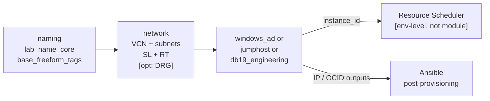

# Architecture Overview - OraDBA OCI Labs

Modular OCI lab infrastructure for Oracle technology testing, security demos,
and training. Terraform modules are generic building blocks; lab stacks in `envs/`
compose them with lab-specific parameters.

---

## Design Principle: Generic Modules, Lab-Specific Envs

```text
modules/          <- Generic. No lab-specific defaults. All behaviour via variables.
envs/<lab>/       <- Lab-specific. Composes modules, sets all parameters, owns
                     lab-only resources (Resource Scheduler, lab-specific IAM).
```

**Rule:** A module default must be reasonable for *any* lab that uses the module.
If a value only makes sense for one specific lab (domain name, tenancy, VPN OCID),
it belongs in `envs/<lab>/variables.tf` or `envs/<lab>/terraform.tfvars`.

---

## Repository Layout

```text
oci-labs/
├── terraform/
│   ├── modules/        # Generic reusable building blocks
│   │   ├── naming/
│   │   ├── network/
│   │   ├── windows_ad/
│   │   ├── jumphost_gateway/
│   │   ├── db19_engineering/
│   │   └── iam_mfa_oma/
│   └── envs/           # Lab stacks (one directory per lab, self-contained)
│       ├── ad-cmu-test/
│       ├── odb19eng-single/
│       ├── odb19sec-dg/
│       └── mfa_oma_setup/
├── ansible/
│   ├── roles/          # Generic configuration roles (Linux + Windows)
│   └── playbooks/      # Lab-specific playbooks
└── docs/               # Runbooks, specs, naming concept
```

---

## Module Catalogue

<!-- markdownlint-disable MD013 MD060 -->
| Module | Path | Purpose | Generic? |
|---|---|---|---|
| **naming** | `modules/naming` | Derives `lab_name_core` and `base_freeform_tags` from region/env/stack/instance | yes |
| **network** | `modules/network` | VCN, subnets, gateways, route tables, security lists, flow logs, optional DRG attachment | yes |
| **windows_ad** | `modules/windows_ad` | Windows Server 2022 AD DC (NSG, cloud-init WinRM); domain name set by caller | yes |
| **jumphost_gateway** | `modules/jumphost_gateway` | Oracle Linux jumphost with cloud-init Ansible bootstrap and WireGuard support | yes |
| **db19_engineering** | `modules/db19_engineering` | Oracle DB 19c engineering instance | yes |
| **iam_mfa_oma** | `modules/iam_mfa_oma` | OCI IAM resources for Oracle DB Native MFA with OMA Push | yes |
<!-- markdownlint-enable MD013 MD060 -->

### What belongs in modules

- Compute/network/IAM resource definitions
- Security List / NSG rules
- Cloud-init templates
- Sensible shape/size defaults (neutral, not personal-tenancy-specific)
- Optional features via boolean variables (e.g. `internet_gateway_enabled`, `drg_id`)

### What does NOT belong in modules

- Domain names (`oradba.ch`, `trivadislabs.com`) - set in env
- Tenancy / compartment OCIDs - set in env
- VPN / DRG OCIDs - set in env
- Resource Scheduler schedules - set in env (lab lifecycle varies per env)
- `allowed_rdp_cidrs` / IP allow-lists - set in env

---

## Lab Stack Catalogue

<!-- markdownlint-disable MD013 MD060 -->
| Stack | Path | Stack-code | Runbook |
|---|---|---|---|
| **ad-cmu-test** | `envs/ad-cmu-test` | `windc` | [runbook-ad-cmu-lab.md](runbook-ad-cmu-lab.md) |
| **odb19eng-single** | `envs/odb19eng-single` | `odb19eng` | [lab-odb19eng-single.md](lab-odb19eng-single.md) |
| **odb19sec-dg** | `envs/odb19sec-dg` | `odb19sec` | [lab-odb19sec-dg.md](lab-odb19sec-dg.md) |
| **mfa_oma_setup** | `envs/mfa_oma_setup` | `mfaoma` | [runbook-mfa-oma.md](runbook-mfa-oma.md) |
<!-- markdownlint-enable MD013 MD060 -->

---

## Naming Convention

All OCI resource names follow the pattern:

```text
{resource_abbrev}-{region}-{env}-{stack}-{component}-{seq}
```

Example: `ci-chzh-l-windc-windc-01` (compute instance, Zurich, lab, windc stack)

The `naming` module produces `lab_name_core = "{region}-{env}-{stack}-{seq}"` which
all other modules embed into their resource display names.

Full details: [namingconcept.md](namingconcept.md)

---

## Network Design

Every lab stack gets its own VCN. The `network` module provisions a standardised
set of subnets:

```text
VCN  10.19.0.0/16  (default CIDR, overridable)
├── sn-*-public-01   10.19.10.0/24   IGW route  - jumphost, bastion, WireGuard endpoint
├── sn-*-private-01  10.19.20.0/24   NAT route  - generic private hosts
├── sn-*-db-01       10.19.30.0/24   NAT route  - Oracle DB instances
├── sn-*-app-01      10.19.40.0/24   NAT route  - application tier
└── sn-*-windows-01  10.19.50.0/24   IGW route  - Windows AD DC
```

### DRG / Site-to-Site VPN

The `network` module supports an optional DRG attachment for site-to-site VPN
connectivity. When `drg_id` is set, the module:

- Creates a DRG VCN attachment to the specified DRG
- Adds routes to `home_cidrs` via DRG in the Windows route table
- Opens AD/Kerberos ingress rules from `home_cidrs` in the Windows Security List

```hcl
# env-level (ad-cmu-test/main.tf)
module "network" {
  source     = "../../modules/network"
  drg_id     = var.drg_id     # OCID of existing DRG (deep-thought VPN)
  home_cidrs = var.home_cidrs # ["192.168.1.0/24", "10.8.0.0/24"]
  ...
}
```

This enables Kerberos authentication from local Docker containers via the existing
home lab IPSec VPN (UDM site-to-site, deep-thought repo) - no jumphost required.

---

## Deployment Pattern



The `naming` module always runs first; its `lab_name_core` and `freeform_tags`
flow into every other module. Each env composes only the modules it needs.

### env directory structure

```text
envs/<lab>/
├── provider.tf      # OCI provider profile (lab-specific, e.g. ACE)
├── variables.tf     # All variable declarations + lab-specific defaults
├── terraform.tfvars # Actual values (gitignored for secrets)
├── main.tf          # Module composition + lab-only resources (Scheduler)
└── outputs.tf       # Useful post-apply outputs (IPs, OCIDs, schedule ID)
```

---

## Resource Scheduler Pattern

Auto-stop schedules are declared in the env (not in modules) because stop/start
times are lab-specific and the module has no concept of lab lifecycle.

```hcl
# envs/ad-cmu-test/main.tf
resource "oci_resource_scheduler_schedule" "windows_ad_stop" {
  compartment_id     = var.compartment_ocid
  action             = "STOP_RESOURCE"
  recurrence_type    = "CRON"
  recurrence_details = "0 18 * * *"   # 18:00 UTC = 20:00 CEST / 19:00 CET
  resources {
    id = module.windows_ad.instance_id
  }
}
```

Manual start: OCI Console → Compute → Instances → Start, or:

```bash
oci compute instance action --profile ACE \
  --instance-id <instance_ocid> --action START
```

---

## Security Principles

- Legacy IMDS endpoints disabled (`are_legacy_imds_endpoints_disabled = true`)
- PV encryption in transit enabled on all instances
- `lifecycle { ignore_changes = [source_details[0].source_id] }` prevents forced
  rebuilds on image updates
- Sensitive variables (`admin_password_secret`) never committed - passed via
  `TF_VAR_*` or `op read "op://AI-DevOps/WinDC/password"`
- Default Security Lists are emptied; all rules explicit in named Security Lists
- No public IPs on AD/DB instances by default (`assign_public_ip = false`)
- RDP/SSH external access only via `allowed_rdp_cidrs` / `allowed_ssh_cidrs`
  (defaults empty or 0.0.0.0/0 for SSH on jumphost)
