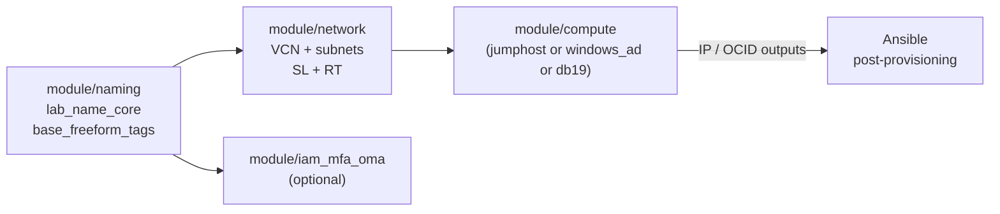

# Architecture Overview - OraDBA OCI Labs

This document describes the modular architecture of the `oci-labs` repository:
reusable Terraform modules assembled into lab stacks, paired with Ansible roles
for post-provisioning configuration.

---

## Repository Layout

```text
oci-labs/
├── terraform/
│   ├── modules/        # Reusable building blocks (network, compute, iam)
│   └── envs/           # Lab stacks (named by use-case, each self-contained)
├── ansible/
│   ├── roles/          # Configuration roles (Linux + Windows)
│   └── playbooks/      # Lab-specific playbooks
└── docs/               # Runbooks, specs, naming concept
```

---

## Module Catalogue

<!-- markdownlint-disable MD013 MD060 -->
| Module | Path | Purpose |
|---|---|---|
| **naming** | `modules/naming` | Derives `lab_name_core` and `base_freeform_tags` from region/env/stack/instance |
| **network** | `modules/network` | VCN, subnets (public/private/db/app/windows), gateways, route tables, security lists, flow logs |
| **jumphost_gateway** | `modules/jumphost_gateway` | Oracle Linux jumphost with cloud-init Ansible bootstrap and WireGuard support |
| **db19_engineering** | `modules/db19_engineering` | Oracle DB 19c engineering instance |
| **windows_ad** | `modules/windows_ad` | Windows Server 2022 AD DC for Oracle CMU + Kerberos testing |
| **iam_mfa_oma** | `modules/iam_mfa_oma` | OCI IAM resources for Oracle DB Native MFA with OMA Push |
<!-- markdownlint-enable MD013 MD060 -->

---

## Lab Stack Catalogue

<!-- markdownlint-disable MD013 MD060 -->
| Stack | Path | Stack-code | Runbook |
|---|---|---|---|
| **odb19eng-single** | `envs/odb19eng-single` | `odb19eng` | [lab-odb19eng-single.md](lab-odb19eng-single.md) |
| **odb19sec-dg** | `envs/odb19sec-dg` | `odb19sec` | [lab-odb19sec-dg.md](lab-odb19sec-dg.md) |
| **mfa_oma_setup** | `envs/mfa_oma_setup` | `mfaoma` | [runbook-mfa-oma.md](runbook-mfa-oma.md) |
| **ad-cmu-test** | `envs/ad-cmu-test` | `windc` | [runbook-ad-cmu-lab.md](runbook-ad-cmu-lab.md) |
<!-- markdownlint-enable MD013 MD060 -->

---

## Naming Convention

All OCI resource names follow the pattern:

```text
{resource_abbrev}-{region}-{env}-{stack}-{component}-{seq}
```

Example: `ci-chzh-l-windc-windc-01` (compute instance, Zurich, lab, windc stack)

The `naming` module produces `lab_name_core = "{region}-{env}-{stack}-{seq}"` which
all other modules embed into their resource display names.

Full details: [namingconcept.md](namingconcept.md)

---

## Network Design

Every lab stack gets its own VCN. The `network` module provisions a standardised
set of subnets:

```text
VCN  10.19.0.0/16
├── sn-*-public-01   10.19.10.0/24   IGW route  – jumphost, bastion
├── sn-*-private-01  10.19.20.0/24   NAT route  – generic private hosts
├── sn-*-db-01       10.19.30.0/24   NAT route  – Oracle DB instances
├── sn-*-app-01      10.19.40.0/24   NAT route  – application tier
└── sn-*-windows-01  10.19.50.0/24   IGW route  – Windows AD DC
```

Security Lists use dynamic blocks for consistent egress rules (`common_egress_rules`)
plus subnet-specific ingress. Windows subnet adds full AD/Kerberos ingress ruleset.

---

## Deployment Pattern



Each env (`envs/`) composes these modules. The naming module runs first;
its outputs flow into every other module as `lab_name_core` and `freeform_tags`.

---

## Security Principles

- Legacy IMDS endpoints disabled on all compute instances (`are_legacy_imds_endpoints_disabled = true`)
- PV encryption in transit enabled on all instances
- `lifecycle { ignore_changes = [source_details[0].source_id] }` prevents forced rebuilds on image updates
- Sensitive variables (`admin_password_secret`, OCIDs) never committed to VCS - passed via `TF_VAR_*` or `op run`
- Default Security Lists are emptied; all rules are explicit in named Security Lists
