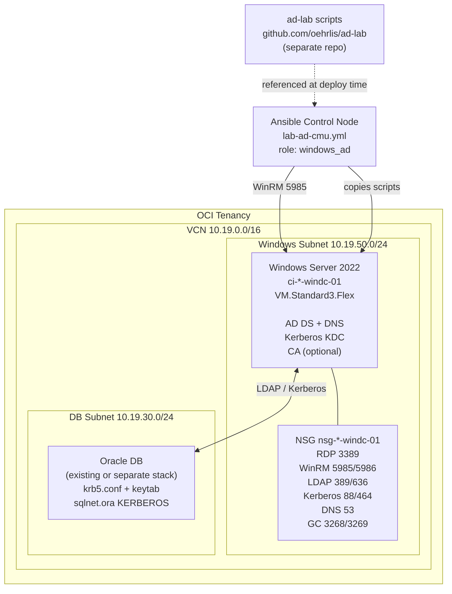

# Runbook: ad-cmu-test - Windows AD Lab for Oracle CMU + Kerberos

Runbook for the `ad-cmu-test` Terraform stack that provisions a Windows Server 2022
Active Directory domain controller on OCI for Oracle Central Management Unit (CMU)
and Kerberos authentication testing.

The stack creates:

- VCN with dedicated Windows AD subnet (`10.19.50.0/24`, IGW route)
- Security List with all required AD ports (RDP, WinRM, LDAP/S, Kerberos, DNS, GC)
- Windows Server 2022 instance (`ci-*-windc-01`, VM.Standard3.Flex)
- Instance-level NSG for fine-grained port control
- cloudbase-init bootstrap: WinRM enabled, Administrator password set

DB-side Kerberos configuration (sqlnet.ora, krb5.conf, keytab extraction) is
performed after the Ansible role completes, using the AD outputs from this stack.

---

## Architecture



---

## Component Overview

<!-- markdownlint-disable MD013 MD060 -->
| Component | Resource | Purpose |
|---|---|---|
| **Windows Subnet** | `oci_core_subnet` (`sn-*-windows-01`) | Dedicated /24 for the DC; public-capable (public IP assignable) but defaults to private. Routed via IGW for optional internet access. |
| **Security List** | `oci_core_security_list` (`sl-*-windows-01`) | Subnet-level firewall with all AD/Kerberos ports open from VCN CIDR. Optional external RDP via `allowed_rdp_cidrs`. |
| **Windows AD Instance** | `oci_core_instance` (`ci-*-windc-01`) | Windows Server 2022 (VM.Standard3.Flex, x86). cloudbase-init enables WinRM on first boot. IMDS legacy endpoints disabled, PV encryption in transit enabled. |
| **NSG** | `oci_core_network_security_group` (`nsg-*-windc-01`) | Instance-level NSG repeating AD ports. Complements the subnet SL for defence-in-depth. |
| **ad-lab scripts** | External repo (oehrlis/ad-lab) | PowerShell scripts for AD DS install, user/SPN setup, DNS, CA, and CMU config. Not embedded - referenced at Ansible deploy time. |
<!-- markdownlint-enable MD013 MD060 -->

---

## Network Ports Reference

<!-- markdownlint-disable MD013 -->
| Port | Protocol | Service | Required for |
|---|---|---|---|
| 3389 | TCP | RDP | Management access (optional direct, via jumphost/VPN in lab) |
| 5985 | TCP | WinRM HTTP | Ansible management |
| 5986 | TCP | WinRM HTTPS | Ansible management (encrypted) |
| 389 | TCP/UDP | LDAP | Oracle DB CMU LDAP queries |
| 636 | TCP | LDAPS | Oracle DB CMU LDAP over TLS |
| 88 | TCP/UDP | Kerberos | Oracle DB Kerberos authentication |
| 464 | TCP/UDP | Kerberos pwd | Kerberos password change |
| 53 | TCP/UDP | DNS | Name resolution within VCN |
| 3268 | TCP | Global Catalog | Forest-wide LDAP queries |
| 3269 | TCP | Global Catalog SSL | Forest-wide LDAP over TLS |
<!-- markdownlint-enable MD013 -->

---

## Prerequisites

<!-- markdownlint-disable MD013 MD060 -->
| Requirement | Detail |
|---|---|
| OCI Tenancy | Compartment OCID in region with VM.Standard3.Flex availability |
| OCI CLI configured | `~/.oci/config` with DEFAULT profile |
| Terraform >= 1.5 | `terraform version` |
| 1Password CLI (`op`) | For `admin_password_secret` retrieval |
| Ansible with ansible.windows | `ansible-galaxy collection install ansible.windows` |
| ad-lab repo checked out | `git clone https://github.com/oehrlis/ad-lab.git` adjacent to oci-labs |
| WinRM reachable | Control node must reach Windows DC on port 5985 (VPN or jumphost) |
<!-- markdownlint-enable MD013 MD060 -->

---

## Step 1 - Clone and Navigate

```bash
git clone https://github.com/oehrlis/oci-labs.git
cd oci-labs/terraform/envs/ad-cmu-test
```

Also check out ad-lab scripts (used by Ansible at deploy time):

```bash
git clone https://github.com/oehrlis/ad-lab.git ../../../ad-lab
```

---

## Step 2 - Configure terraform.tfvars

Edit `terraform.tfvars` and fill in the required values:

```hcl
compartment_ocid = "ocid1.compartment.oc1..aaaa<your-value>"
region_key       = "chzh"          # eu-zurich-1 → chzh, eu-frankfurt-1 → fra
domain_name      = "trivadislabs.com"
```

Leave `admin_password_secret` out of the file - set it at apply time via env var (see Step 4).

To allow direct RDP from your workstation (optional, lab only):

```hcl
allowed_rdp_cidrs            = ["<your-public-ip>/32"]
assign_windows_public_ip     = true
```

---

## Step 3 - Init

```bash
terraform init
```

---

## Step 4 - Plan and Apply

Set the Windows Administrator password from 1Password before applying:

```bash
export TF_VAR_admin_password_secret=$(op read "op://AI-DevOps/WinDC/password")
terraform plan -out=tfplan
terraform apply tfplan
```

The apply creates the VCN, subnet, NSG, and the Windows instance. cloudbase-init
runs on first boot (~5 minutes) and enables WinRM.

---

## Step 5 - Get Outputs

```bash
terraform output
```

Key outputs:

```text
windows_private_ip   = "10.19.50.x"
windows_public_ip    = ""            # empty if assign_windows_public_ip = false
windows_instance_name = "ci-chzh-l-windc-01"
```

---

## Step 6 - Wait for WinRM

Wait approximately 5-10 minutes for cloudbase-init to complete. Then verify WinRM:

```bash
# From a host inside the VCN or via VPN
ansible windows_dc -i <inventory> -m ansible.windows.win_ping \
  -e "ansible_host=<windows_private_ip>" \
  -e "ansible_user=Administrator" \
  -e "ansible_password=$(op read 'op://AI-DevOps/WinDC/password')" \
  -e "ansible_connection=winrm" \
  -e "ansible_winrm_transport=basic" \
  -e "ansible_winrm_port=5985" \
  -e "ansible_winrm_scheme=http"
```

Expected response: `pong`

---

## Step 7 - Create Ansible Inventory

Create `ansible/inventories/ad-cmu-test/hosts.yml`:

```yaml
all:
  children:
    windows_dc:
      hosts:
        windc01:
          ansible_host: "10.19.50.x"   # from terraform output windows_private_ip
          ansible_user: Administrator
          ansible_connection: winrm
          ansible_winrm_transport: basic
          ansible_winrm_port: 5985
          ansible_winrm_scheme: http
          ansible_winrm_server_cert_validation: ignore
```

Create `ansible/inventories/ad-cmu-test/group_vars/windows_dc.yml` (Vault-encrypted):

```yaml
windows_ad_domain: "trivadislabs.com"
windows_ad_netbios: "TRIVADISLABS"
windows_ad_company: "Trivadis Labs"
windows_ad_admin_user: "Administrator"
windows_ad_scripts_src: "../../../../ad-lab"
```

---

## Step 8 - Run Ansible Role

```bash
cd oci-labs/ansible

ansible-playbook playbooks/lab-ad-cmu.yml \
  -i inventories/ad-cmu-test/hosts.yml \
  -e "ansible_password=$(op read 'op://AI-DevOps/WinDC/password')"
```

The playbook executes (in order):

1. WinRM ping check
2. Create scripts directory (`C:\OraLab\Scripts`)
3. Copy ad-lab scripts from local checkout
4. Render `00_init_environment.ps1` (domain, company, netbios)
5. `01_install_ad_role.ps1` → reboot (~5 min)
6. Wait for LDAP port 389
7. `11_add_lab_company.ps1` (OUs, company structure)
8. `11_add_service_principles.ps1` (SPNs for Oracle DB)
9. `12_config_dns.ps1` (forwarders)
10. `13_config_ca.ps1` (AD CS, optional)
11. `27_config_cmu.ps1` (Oracle CMU schema extensions)

---

## Step 9 - Verify Active Directory

From the Windows DC (RDP or `win_shell`):

```powershell
# Check AD DS is running
Get-Service adws, kdc, netlogon, dns | Select-Object Name, Status

# Verify domain
Get-ADDomain | Select-Object DNSRoot, NetBIOSName, DomainMode

# List SPNs for Oracle
Get-ADUser -Filter * -Properties ServicePrincipalNames |
  Where-Object { $_.ServicePrincipalNames } |
  Select-Object SamAccountName, ServicePrincipalNames
```

---

## Step 10 - Configure Oracle DB for CMU / Kerberos

After the AD is fully configured, set up the Oracle DB server (performed manually
or via a separate Ansible role on the DB host):

### 10.1 Kerberos configuration (`/etc/krb5.conf`)

```ini
[libdefaults]
  default_realm = TRIVADISLABS.COM
  dns_lookup_realm = false
  dns_lookup_kdc = false
  ticket_lifetime = 24h
  renew_lifetime = 7d
  forwardable = true

[realms]
  TRIVADISLABS.COM = {
    kdc = <windows_private_ip>
    admin_server = <windows_private_ip>
  }

[domain_realm]
  .trivadislabs.com = TRIVADISLABS.COM
  trivadislabs.com = TRIVADISLABS.COM
```

### 10.2 sqlnet.ora

```ini
SQLNET.AUTHENTICATION_SERVICES = (BEQ, KERBEROS5)
SQLNET.KERBEROS5_CONF = /etc/krb5.conf
SQLNET.KERBEROS5_KEYTAB = /etc/v5srvtab
SQLNET.KERBEROS5_CC_NAME = FILE:/tmp/kerbcc
SQLNET.KERBEROS5_CLOCKSKEW = 300
```

### 10.3 Extract Kerberos keytab from AD

Run on the Windows DC (as Domain Admin):

```powershell
ktpass -princ oracle/<db-hostname>.trivadislabs.com@TRIVADISLABS.COM `
       -mapuser oracle_kerberos `
       -crypto AES256-SHA1 `
       -ptype KRB5_NT_PRINCIPAL `
       -pass <service-account-password> `
       -out C:\OraLab\v5srvtab
```

Copy `v5srvtab` to the Oracle DB server as `/etc/v5srvtab`, owned by oracle:oinstall, mode 600.

### 10.4 Oracle DB CMU configuration

```sql
-- Enable CMU (requires Oracle DB 19c+ or 21c+)
ALTER SYSTEM SET ldap_directory_access = 'PASSWORD' SCOPE=SPFILE;
ALTER SYSTEM SET ldap_directory_sysauth = YES SCOPE=SPFILE;

-- Configure LDAP server
BEGIN
  DBMS_LDAP_UTL.CREATE_REGISTRATION_CONTEXT(
    hostname  => '<windows_private_ip>',
    port      => 389,
    dn        => 'DC=trivadislabs,DC=com',
    use_ssl   => 'N'
  );
END;
/
```

---

## Teardown

```bash
cd oci-labs/terraform/envs/ad-cmu-test
export TF_VAR_admin_password_secret=$(op read "op://AI-DevOps/WinDC/password")
terraform destroy
```

---

## Troubleshooting

<!-- markdownlint-disable MD013 MD060 -->
| Symptom | Likely cause | Fix |
|---|---|---|
| `win_ping` fails with connection refused | WinRM not yet ready | Wait 5-10 min after instance start; check cloudbase-init log in OCI Console serial output |
| `win_ping` fails with auth error | Wrong password or WinRM Basic auth disabled | Verify cloudbase-init ran: check OCI console serial output; re-run with correct password |
| AD DS install fails (reboot loop) | Insufficient memory | Increase `windows_memory_gbs` to 16+ GB |
| LDAP port 389 not responding after reboot | AD services slow start | Increase `timeout` in `win_wait_for` task to 600s |
| Kerberos `kinit` fails on DB host | KDC unreachable or clock skew | Verify VCN routing, check NTP sync on both DC and DB host (`chronyd`) |
| CMU LDAP queries fail | LDAP port blocked | Verify NSG and Security List allow TCP 389 from DB subnet |
<!-- markdownlint-enable MD013 MD060 -->
