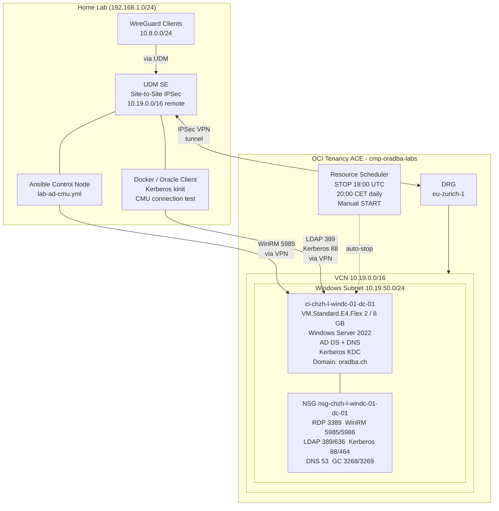

# Runbook: ad-cmu-test - Windows AD Lab for Oracle CMU + Kerberos

Runbook for the `ad-cmu-test` Terraform stack that provisions a Windows Server 2022
Active Directory domain controller on OCI for Oracle Central Management Unit (CMU)
and Kerberos authentication testing.

The stack creates:

- VCN (`10.19.0.0/16`) with dedicated Windows AD subnet (`10.19.50.0/24`, IGW route)
- DRG VCN attachment for site-to-site VPN connectivity (home lab via deep-thought DRG)
- Security List with all required AD ports (RDP, WinRM, LDAP/S, Kerberos, DNS, GC)
- Ingress rules from home CIDRs (`192.168.1.0/24`, `10.8.0.0/24`) for AD/Kerberos
- Windows Server 2022 instance (`ci-chzh-l-windc-01-dc-01`, VM.Standard.E4.Flex 2 OCPUs / 8 GB)
- Instance-level NSG for fine-grained port control
- cloudbase-init bootstrap: WinRM enabled, Administrator password set
- Resource Scheduler: auto-stop daily 20:00 Europe/Zurich (18:00 UTC), manual start only

Connectivity to the Windows DC uses the existing home lab IPSec VPN
(UDM site-to-site, managed via `deep-thought/terraform/oci/vpn`). No OCI jumphost needed.

DB-side Kerberos configuration (sqlnet.ora, krb5.conf, keytab extraction) is
performed after the Ansible role completes, using the AD outputs from this stack.

---

## Architecture



---

## Component Overview

<!-- markdownlint-disable MD013 MD060 -->
| Component | Resource | Purpose |
|---|---|---|
| **VCN** | `oci_core_vcn` (`vcn-chzh-l-windc-01`) | Lab-dedicated VCN, `10.19.0.0/16`. Attached to existing DRG for home lab VPN. |
| **DRG Attachment** | `oci_core_drg_attachment` (`drga-chzh-l-windc-01`) | Attaches VCN to existing DRG (deep-thought VPN). Routes `192.168.1.0/24`, `10.8.0.0/24` via DRG in Windows route table. |
| **Windows Subnet** | `oci_core_subnet` (`sn-chzh-l-windc-01`) | Dedicated /24 for the DC; public-capable (public IP assignable) but defaults to private IP only. |
| **Security List** | `oci_core_security_list` (`sl-chzh-l-windc-01`) | Subnet-level firewall with all AD/Kerberos ports from VCN CIDR + home CIDRs. Optional external RDP via `allowed_rdp_cidrs`. |
| **Windows AD Instance** | `oci_core_instance` (`ci-chzh-l-windc-01-dc-01`) | Windows Server 2022 (VM.Standard.E4.Flex, 2 OCPUs / 8 GB, x86). cloudbase-init enables WinRM on first boot. IMDS legacy endpoints disabled, PV encryption in transit enabled. |
| **NSG** | `oci_core_network_security_group` (`nsg-chzh-l-windc-01-dc-01`) | Instance-level NSG repeating AD ports. Defence-in-depth alongside Security List. |
| **Resource Scheduler** | `oci_resource_scheduler_schedule` (`sched-chzh-l-windc-01-dc-stop-01`) | Daily auto-stop at 18:00 UTC (20:00 CEST / 19:00 CET). Start manually via Console or CLI. |
| **ad-lab scripts** | External repo (oehrlis/ad-lab) | PowerShell scripts for AD DS install, user/SPN setup, DNS, CA, and CMU config. Referenced at Ansible deploy time. |
<!-- markdownlint-enable MD013 MD060 -->

---

## Network Ports Reference

<!-- markdownlint-disable MD013 -->
| Port | Protocol | Service | Required for |
|---|---|---|---|
| 3389 | TCP | RDP | Management access (via VPN; no public IP assigned by default) |
| 5985 | TCP | WinRM HTTP | Ansible management |
| 5986 | TCP | WinRM HTTPS | Ansible management (encrypted) |
| 389 | TCP/UDP | LDAP | Oracle DB CMU LDAP queries |
| 636 | TCP | LDAPS | Oracle DB CMU LDAP over TLS |
| 88 | TCP/UDP | Kerberos | Oracle DB Kerberos authentication |
| 464 | TCP/UDP | Kerberos pwd | Kerberos password change |
| 53 | TCP/UDP | DNS | Name resolution within VCN |
| 3268 | TCP | Global Catalog | Forest-wide LDAP queries |
| 3269 | TCP | Global Catalog SSL | Forest-wide LDAP over TLS |
<!-- markdownlint-enable MD013 -->

---

## Prerequisites

<!-- markdownlint-disable MD013 MD060 -->
| Requirement | Detail |
|---|---|
| OCI Tenancy | ACE tenancy, compartment `cmp-oradba-labs` (OCID in `terraform.tfvars`) |
| OCI CLI configured | `~/.oci/config` with `[ACE]` profile |
| Terraform >= 1.5 | `terraform version` |
| oracle/oci provider | Declared as `oracle/oci >= 6.0` in `provider.tf`; child modules have explicit `versions.tf` to avoid defaulting to `hashicorp/oci` |
| 1Password CLI (`op`) | `op read "op://AI-DevOps/WinDC/password"` for `admin_password_secret` |
| Home lab VPN active | UDM site-to-site IPSec to OCI DRG (deep-thought); `10.19.0.0/16` added to UDM remote networks |
| Ansible with ansible.windows | `ansible-galaxy collection install ansible.windows` |
| ad-lab repo checked out | `git clone https://github.com/oehrlis/ad-lab.git` adjacent to oci-labs |
<!-- markdownlint-enable MD013 MD060 -->

---

## Step 1 - Clone and Navigate

```bash
git clone https://github.com/oehrlis/oci-labs.git
cd oci-labs/terraform/envs/ad-cmu-test
```

Also check out ad-lab scripts (used by Ansible at deploy time):

```bash
git clone https://github.com/oehrlis/ad-lab.git ../../../ad-lab
```

---

## Step 2 - Configure terraform.tfvars

`terraform.tfvars` is gitignored (contains compartment OCID). Create from the example
or copy the existing file. Key values for this stack:

```hcl
compartment_ocid = "ocid1.compartment.oc1..aaaaaaaaxq7bir4bjy3bzozyjd4idlvharoco3ww5jx5nzzvv6rhcypb6cfa"
region_key       = "chzh"
domain_name      = "oradba.ch"

windows_shape      = "VM.Standard.E4.Flex"
windows_ocpus      = 2
windows_memory_gbs = 8

drg_id = "ocid1.drg.oc1.eu-zurich-1.aaaaaaaa6lag2i4uv64up6elwntezqd64xbtpcal5nqltps2cxculppgncka"
home_cidrs = [
  "192.168.1.0/24",
  "10.8.0.0/24",
]
```

Leave `admin_password_secret` out of the file - set it at apply time via environment variable (see Step 4).

To allow direct RDP from a specific external IP (optional, lab only):

```hcl
allowed_rdp_cidrs        = ["<your-public-ip>/32"]
assign_windows_public_ip = true
```

---

## Step 3 - Init

```bash
terraform init
```

Expected: only `oracle/oci` appears in the lock file. If `hashicorp/oci` appears too,
delete `.terraform/` and `.terraform.lock.hcl` and re-run `terraform init`.

---

## Step 4 - Plan and Apply

```bash
export TF_VAR_admin_password_secret=$(op read "op://AI-DevOps/WinDC/password")
terraform plan -out=tfplan
terraform apply tfplan
```

The apply creates the VCN, DRG attachment, subnets, Security List, NSG, Windows instance,
and Resource Scheduler. cloudbase-init runs on first boot (~5-10 minutes) and enables WinRM.

---

## Step 5 - Get Outputs

```bash
terraform output
```

Key outputs:

```text
windows_private_ip    = "10.19.50.x"
windows_public_ip     = ""
windows_instance_name = "ci-chzh-l-windc-01-dc-01"
auto_stop_schedule_id = "ocid1.resourceschedulerschedule.oc1..."
```

---

## Step 6 - RDP / Windows App Access

Connect via VPN (home lab IPSec or WireGuard). No public IP is assigned by default.

| Field | Value |
|---|---|
| Host | `terraform output -raw windows_private_ip` (e.g. `10.19.50.x`) |
| Port | `3389` |
| Username | `Administrator` |
| Password | `op read "op://AI-DevOps/WinDC/password"` |

```bash
# Get IP
WIN_IP=$(cd /path/to/oci-labs/terraform/envs/ad-cmu-test && terraform output -raw windows_private_ip)

# Get password
WIN_PASS=$(op read "op://AI-DevOps/WinDC/password")

# macOS: open Remote Desktop (Microsoft Remote Desktop app)
open "rdp://full%20address=s:${WIN_IP}:3389&username=s:Administrator"
```

Or use the Microsoft Remote Desktop app directly:
- New PC → PC name: `10.19.50.x` → User account: `Administrator` / password from 1Password

---

## Step 7 - Start / Stop (Resource Scheduler)

The instance auto-stops daily at **20:00 Europe/Zurich** (18:00 UTC).
Start manually when needed:

```bash
# Start via OCI CLI
oci compute instance action --profile ACE \
  --instance-id $(terraform output -raw windows_instance_id) \
  --action START

# Or via Console: Compute → Instances → ci-chzh-l-windc-01-dc-01 → Start
```

---

## Step 8 - Wait for WinRM

After apply, `terraform apply` blocks until WinRM on port 5985 responds (via the
`null_resource.wait_for_winrm` provisioner). The Ansible inventory is written
immediately with the new private IP - before the polling loop - so the inventory
is always current even if you interrupt the apply early.

Verify connectivity manually once apply completes:

```bash
export WIN_PASS=$(op read "op://AI-DevOps/WinDC/password")
cd /path/to/oci-labs   # always run ansible from the oci-labs repo root

ansible all -i ansible/inventories/ad-cmu-test/ \
  -e ansible_user=Administrator -e "ansible_password=$WIN_PASS" \
  -m win_ping
```

Expected response: `pong`

If connection refused: check VPN is up and `10.19.0.0/16` is in UDM remote networks.

---

## Step 8a - Monitor cloudbase-init

cloudbase-init runs in two phases. All commands below require VPN connectivity
and must be run from the `oci-labs` repo root.

```bash
export WIN_PASS=$(op read "op://AI-DevOps/WinDC/password")
```

**Check which log files exist and their sizes:**

```bash
ansible all -i ansible/inventories/ad-cmu-test/ \
  -e ansible_user=Administrator -e "ansible_password=$WIN_PASS" \
  -m win_shell -a "Get-ChildItem C:\\OraLab\\logs | Format-Table Name,LastWriteTime,Length -AutoSize"
```

Expected progression:

<!-- markdownlint-disable MD013 -->
| Files present | Phase | Meaning |
|---|---|---|
| `cloudinit-phase1.log` (0 B) | Phase 1 starting | WinRM enabled, downloading scripts, installing AD DS role |
| `cloudinit-phase1.log` (> 0 B), no phase2 log | Phase 1 complete | AD DS installed, instance rebooting into domain promote |
| `cloudinit-phase2.log` (0 B) | Phase 2 starting | DC rebooted, waiting for AD Web Services |
| `cloudinit-phase2.log` (> 0 B) | Phase 2 running | AD setup scripts executing |
| `setup-complete.txt` present | Done | Full lab setup complete |
<!-- markdownlint-enable MD013 -->

**Tail phase 1 log (AD DS role install, ~5-10 min):**

```bash
ansible all -i ansible/inventories/ad-cmu-test/ \
  -e ansible_user=Administrator -e "ansible_password=$WIN_PASS" \
  -m win_shell -a "Get-Content C:\\OraLab\\logs\\cloudinit-phase1.log -Tail 20 -ErrorAction SilentlyContinue"
```

**Tail phase 2 log (AD setup scripts, ~5-10 min after reboot):**

```bash
ansible all -i ansible/inventories/ad-cmu-test/ \
  -e ansible_user=Administrator -e "ansible_password=$WIN_PASS" \
  -m win_shell -a "Get-Content C:\\OraLab\\logs\\cloudinit-phase2.log -Tail 30 -ErrorAction SilentlyContinue"
```

**Check for individual script logs** (each ad-lab script writes its own log via CommonFunctions):

```bash
ansible all -i ansible/inventories/ad-cmu-test/ \
  -e ansible_user=Administrator -e "ansible_password=$WIN_PASS" \
  -m win_shell -a "Get-ChildItem C:\\OraLab\\logs -Filter *.log | Format-Table Name,LastWriteTime,Length -AutoSize"
```

**Check setup-complete marker:**

```bash
ansible all -i ansible/inventories/ad-cmu-test/ \
  -e ansible_user=Administrator -e "ansible_password=$WIN_PASS" \
  -m win_shell -a "Get-Content C:\\OraLab\\logs\\setup-complete.txt -ErrorAction SilentlyContinue"
```

---

## Step 9 - Ansible Inventory

The inventory file `ansible/inventories/ad-cmu-test/hosts.yml` is committed to the
repo. The `null_resource.wait_for_winrm` provisioner overwrites it with the current
private IP on every `terraform apply` that replaces the instance.

If you need to update the IP manually:

```bash
# Get current IP from Terraform state
terraform -chdir=terraform/envs/ad-cmu-test output -raw windows_private_ip

# Update hosts.yml (replace 10.19.50.x with actual IP)
```

`ansible/inventories/ad-cmu-test/hosts.yml`:

```yaml
all:
  children:
    windows_dc:
      hosts:
        windc01:
          ansible_host: "10.19.50.x"   # from terraform output windows_private_ip
```

WinRM connection parameters are in `group_vars/windows_dc.yml` (already committed):

```yaml
ansible_connection: winrm
ansible_winrm_transport: basic
ansible_winrm_port: 5985
ansible_winrm_scheme: http
ansible_winrm_server_cert_validation: ignore
```

---

## Step 10 - Run Ansible Role

```bash
cd oci-labs/ansible

ansible-playbook playbooks/lab-ad-cmu.yml \
  -i inventories/ad-cmu-test/hosts.yml \
  -e "ansible_password=$(op read 'op://AI-DevOps/WinDC/password')"
```

The playbook executes (in order):

1. WinRM ping check
2. Create scripts directory (`C:\OraLab\Scripts`)
3. Copy ad-lab scripts from local checkout
4. Render `00_init_environment.ps1` (domain, company, netbios)
5. `01_install_ad_role.ps1` → reboot (~5 min)
6. Wait for LDAP port 389
7. `11_add_lab_company.ps1` (OUs, company structure)
8. `11_add_service_principles.ps1` (SPNs for Oracle DB)
9. `12_config_dns.ps1` (forwarders)
10. `13_config_ca.ps1` (AD CS, optional)
11. `27_config_cmu.ps1` (Oracle CMU schema extensions)

---

## Step 11 - Verify Active Directory

From the Windows DC (RDP via VPN to `10.19.50.x`, or `win_shell`):

```powershell
# Check AD DS is running
Get-Service adws, kdc, netlogon, dns | Select-Object Name, Status

# Verify domain
Get-ADDomain | Select-Object DNSRoot, NetBIOSName, DomainMode

# List SPNs for Oracle
Get-ADUser -Filter * -Properties ServicePrincipalNames |
  Where-Object { $_.ServicePrincipalNames } |
  Select-Object SamAccountName, ServicePrincipalNames
```

---

## Step 12 - Configure Oracle DB for CMU / Kerberos

After the AD is fully configured, set up the Oracle DB server (manually or via a
separate Ansible role on the DB host):

### 11.1 Kerberos configuration (`/etc/krb5.conf`)

```ini
[libdefaults]
  default_realm = ORADBA.CH
  dns_lookup_realm = false
  dns_lookup_kdc = false
  ticket_lifetime = 24h
  renew_lifetime = 7d
  forwardable = true

[realms]
  ORADBA.CH = {
    kdc = 10.19.50.x
    admin_server = 10.19.50.x
  }

[domain_realm]
  .oradba.ch = ORADBA.CH
  oradba.ch = ORADBA.CH
```

### 11.2 sqlnet.ora

```ini
SQLNET.AUTHENTICATION_SERVICES = (BEQ, KERBEROS5)
SQLNET.KERBEROS5_CONF = /etc/krb5.conf
SQLNET.KERBEROS5_KEYTAB = /etc/v5srvtab
SQLNET.KERBEROS5_CC_NAME = FILE:/tmp/kerbcc
SQLNET.KERBEROS5_CLOCKSKEW = 300
```

### 11.3 Extract Kerberos keytab from AD

Run on the Windows DC (as Domain Admin):

```powershell
ktpass -princ oracle/<db-hostname>.oradba.ch@ORADBA.CH `
       -mapuser oracle_kerberos `
       -crypto AES256-SHA1 `
       -ptype KRB5_NT_PRINCIPAL `
       -pass <service-account-password> `
       -out C:\OraLab\v5srvtab
```

Copy `v5srvtab` to the Oracle DB server as `/etc/v5srvtab`, owned by `oracle:oinstall`, mode 600.

### 11.4 Oracle DB CMU configuration

```sql
-- Enable CMU (requires Oracle DB 19c+ or 21c+)
ALTER SYSTEM SET ldap_directory_access = 'PASSWORD' SCOPE=SPFILE;
ALTER SYSTEM SET ldap_directory_sysauth = YES SCOPE=SPFILE;

-- Configure LDAP server
BEGIN
  DBMS_LDAP_UTL.CREATE_REGISTRATION_CONTEXT(
    hostname  => '10.19.50.x',
    port      => 389,
    dn        => 'DC=oradba,DC=ch',
    use_ssl   => 'N'
  );
END;
/
```

---

## Redeployment (Replace Instance)

Use `terraform apply -replace` to rebuild the Windows DC without touching the network.
This destroys and recreates only the compute instance and triggers a fresh cloudbase-init run.

```bash
cd /path/to/oci-labs
export TF_VAR_admin_password_secret=$(op read "op://AI-DevOps/WinDC/password")

terraform -chdir=terraform/envs/ad-cmu-test apply \
  -replace=module.windows_ad.oci_core_instance.windows_ad
```

What happens:
1. Old instance is destroyed
2. New instance is created with a new OCID and new private IP
3. `null_resource.wait_for_winrm` detects the OCID change (trigger) and re-runs
4. Ansible inventory `hosts.yml` is updated immediately with the new IP
5. Provisioner blocks until WinRM on the new IP responds

After apply completes, cloudbase-init phase 1 and phase 2 run automatically.
Monitor progress using the commands in Step 8a.

---

## Teardown

```bash
cd /path/to/oci-labs
export TF_VAR_admin_password_secret=$(op read "op://AI-DevOps/WinDC/password")
terraform -chdir=terraform/envs/ad-cmu-test destroy
```

This removes VCN, DRG attachment, all subnets, Security Lists, NSG, Windows instance,
and the Resource Scheduler. The DRG itself is managed by deep-thought and is NOT destroyed.

---

## Troubleshooting

<!-- markdownlint-disable MD013 MD060 -->
| Symptom | Likely cause | Fix |
|---|---|---|
| `win_ping` connection refused | WinRM not yet ready | Wait 5-10 min after instance start; check cloudbase-init in OCI Console serial output |
| `win_ping` connection refused (VPN) | VPN tunnel down or wrong remote CIDR | Check UDM VPN status; verify `10.19.0.0/16` is in UDM remote networks |
| `win_ping` auth error | Wrong password or WinRM Basic auth disabled | Verify cloudbase-init completed; re-run with correct password from 1Password |
| `the specified credentials were rejected` | `$WIN_PASS` env var not set | Run `export WIN_PASS=$(op read "op://AI-DevOps/WinDC/password")` - the variable is not persisted between shell sessions |
| Ansible `No inventory was parsed` warning | Wrong working directory or wrong inventory path | Always run ansible from oci-labs repo root: `cd /path/to/oci-labs`, then use `-i ansible/inventories/ad-cmu-test/` |
| Inventory `hosts.yml` has stale IP after redeploy | Provisioner did not run or inventory path was wrong | Terraform provisioner used `path.root` (relative) instead of `abspath(path.root)`. Fixed in current version. Update IP manually: `terraform -chdir=terraform/envs/ad-cmu-test output -raw windows_private_ip` |
| Phase 2 script `27_config_cmu.ps1` fails with exit code 1 | Script error inside child process | Check individual script log: `Get-Content C:\\OraLab\\logs\\27_config_cmu.log`. The phase2 transcript only captures the parent process; each ad-lab script writes its own log via CommonFunctions |
| AD DS install fails (reboot loop) | Insufficient memory | Increase `windows_memory_gbs` to 16 GB |
| `cloudinit-phase2.log` is 0 bytes, never grows | AD Web Services not starting | Phase 2 is waiting for AD; check if DC rebooted successfully via OCI Console serial output |
| LDAP port 389 not responding after reboot | AD services slow start | Wait up to 10 min after reboot; phase2 retries every 20 s up to 300 s |
| Kerberos `kinit` fails on DB host | KDC unreachable or clock skew | Check VPN routing to `10.19.50.x`; verify NTP sync (`chronyd`) on both hosts |
| CMU LDAP queries fail | LDAP port blocked | Check NSG and Security List allow TCP 389 from DB subnet and `home_cidrs` |
| `terraform apply` 404 NotAuthorized | Wrong OCI profile or `hashicorp/oci` picked over `oracle/oci` | Verify `provider.tf` has `config_file_profile = "ACE"`; delete `.terraform/` and `.terraform.lock.hcl`, re-run `terraform init` |
| Instance not starting (auto-stop fired) | Resource Scheduler stopped it as scheduled | `oci compute instance action --profile ACE --instance-id $(terraform -chdir=terraform/envs/ad-cmu-test output -raw windows_instance_id) --action START` |
<!-- markdownlint-enable MD013 MD060 -->
