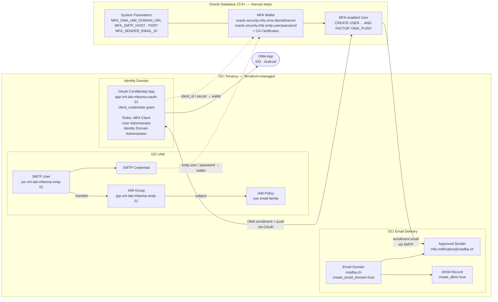

# Runbook: mfa_oma_setup

Runbook for the `mfa_oma_setup` Terraform stack that provisions all OCI-side
prerequisites for Oracle Database Native MFA with OMA Push (Oracle Mobile Authenticator).

The stack calls the `iam_mfa_oma` module and creates:

- OAuth Confidential Application in the OCI Identity Domain
- Dedicated SMTP IAM User, IAM Group, and SMTP Credential
- OCI Email Delivery domain (optional), Approved Sender, DKIM record (optional)
- IAM Policy granting the SMTP group access to email-family

DB-side configuration (ALTER SYSTEM, orapki wallet, user creation) is performed
manually after the Terraform apply using outputs from this stack.

---

## Architecture



---

## Component Overview

<!-- markdownlint-disable MD013 MD060 -->
| Component | Resource | Purpose |
|---|---|---|
| **OAuth App** | `oci_identity_domains_app` | Oracle DB uses client_credentials to authenticate against the Identity Domain for OMA Push enrollment and push triggers. Must have roles: MFA Client, User Administrator, Identity Domain Administrator. |
| **SMTP User** | `oci_identity_user` | Dedicated IAM user for SMTP authentication. Using a dedicated user avoids dependency on personal accounts and allows independent credential rotation. Always created at tenancy root (IAM users are tenancy-wide). |
| **IAM Group** | `oci_identity_group` | Required wrapper for the SMTP User. Identity Domain tenancies reject `Allow user <name>` policy syntax — only group-based policies are valid. |
| **IAM Policy** | `oci_identity_policy` | Grants the SMTP Group `use email-family` in the target compartment. Without this, email sending fails with authorization errors. |
| **SMTP Credential** | `oci_identity_smtp_credential` | Username/password for SMTP authentication. Password is shown only once at apply time — save it immediately. |
| **Email Domain** | `oci_email_email_domain` | Optional. Registers the sender domain in OCI Email Delivery. Required for DKIM. After `apply`, a DNS TXT record must be added to verify ownership. One domain covers all senders under that domain. |
| **Approved Sender** | `oci_email_sender` | Authorises a specific FROM address to send through OCI Email Delivery. Must match `MFA_SENDER_EMAIL_ID` in the DB. **One sender per FROM address** — multiple DBs can share the same sender address. Create separate senders (e.g. `db1-mfa@oradba.ch`) if per-DB tracking is needed. |
| **DKIM Record** | `oci_email_dkim` | Optional. Adds a cryptographic signature to outgoing emails, improving deliverability and spam scores. Requires a verified email domain. |
<!-- markdownlint-enable MD013 MD060 -->

### Email Domain Deployment Phases

Deploying the email domain, verification, and DKIM is a three-phase process because
DNS propagation and OCI domain verification take time:

```text
Phase 1 — Create domain + sender
  create_email_domain = true
  email_domain        = "oradba.ch"
  create_dkim         = false      ← domain not yet verified
  → terraform apply
  → add TXT record from email_domain_verification_id output to DNS

Phase 2 — Verify domain in OCI Console
  OCI Console: Email Delivery → Email Domains → oradba.ch → Verify Domain

Phase 3 — Enable DKIM
  create_dkim = true
  → terraform apply
  → add CNAME record from dkim_cname_name / dkim_cname_value outputs to DNS
```

---

## Prerequisites

Before deploying this stack, verify the following:

<!-- markdownlint-disable MD013 MD060 -->
| Requirement                                      | Detail                                                                         |
|--------------------------------------------------|--------------------------------------------------------------------------------|
| OCI Tenancy with Identity Domain                 | Classic IAM tenancies are not supported                                        |
| OCI Email Delivery available                     | Must be enabled in the target region (e.g. eu-zurich-1)                        |
| Verified email domain                            | The sender domain must be verified in OCI Email Delivery before or after apply |
| Terraform >= 1.3                                 | Check with `terraform version`                                                 |
| OCI CLI configured                               | `~/.oci/config` with DEFAULT or named profile                                  |
| 1Password CLI (`op`)                             | For saving sensitive credentials immediately after apply                       |
| Oracle Database 23.9 minimum                     | 23.26.1 (26ai) ARM64 has a known regression: `FsDirect not implemented`; use 23.9 |
<!-- markdownlint-enable MD013 MD060 -->

---

## Step 1 - Clone and Navigate

Clone the `oci-labs` repository (if not already present) and navigate to the
stack directory.

```bash
git clone https://github.com/oehrlis/oci-labs.git
cd oci-labs/terraform/envs/mfa_oma_setup
```

If you already have the repository, navigate directly:

```bash
cd /path/to/oci-labs/terraform/envs/mfa_oma_setup
```

---

## Step 2 - Configure

### 2.1 Copy example files

```bash
cp .env.example .env
cp terraform.tfvars.example terraform.tfvars
```

### 2.2 Fill .env with sensitive OCIDs

Edit `.env` and populate the three required `TF_VAR_*` variables.
Use `op read` to retrieve OCIDs from 1Password without exposing them in shell history.

```bash
# Example: retrieve OCIDs from 1Password and export them
export TF_VAR_tenancy_ocid=$(op read "op://OCI-Labs/oci-tenancy/tenancy_ocid")
export TF_VAR_compartment_ocid=$(op read "op://OCI-Labs/oci-tenancy/compartment_ocid")
export TF_VAR_identity_domain_ocid=$(op read "op://OCI-Labs/oci-tenancy/identity_domain_ocid")
```

Or store these lines in `.env` and source it before every Terraform command:

```bash
source .env
```

> Note: `.env` is git-ignored. Never commit it. Sensitive OCIDs belong in `.env`,
> not in `terraform.tfvars`.

### 2.3 Fill terraform.tfvars

Edit `terraform.tfvars` with non-sensitive configuration. The defaults match the
lab naming convention (`region_key=zrh`, `env=lab`, `stack=mfaoma`):

```hcl
# OCI provider
oci_profile = "DEFAULT"
region      = "eu-zurich-1"

# Naming convention
region_key   = "zrh"
env          = "lab"
stack        = "mfaoma"
lab_instance = 1
project_tag  = "oradba-labs"

# Email Delivery
smtp_sender_email = "mfa.notification@yourdomain.com"
smtp_sender_name  = "Oracle DB MFA Demo"

# OAuth Application (leave empty to auto-derive from naming convention)
app_name = ""

# Email Domain — Phase 1: create domain (leave create_dkim false until DNS is verified)
create_email_domain = false
# email_domain      = "oradba.ch"

# Email Domain — Phase 3: enable DKIM after domain is verified in OCI Console
create_dkim = false
# email_domain_ocid = "ocid1.emaildomain.oc1.eu-zurich-1.xxx"  # only if create_email_domain = false
```

The naming convention produces resource names like:
`app-zrh-lab-mfaoma-oauth-01`, `usr-zrh-lab-mfaoma-smtp-01`, `pol-zrh-lab-mfaoma-smtp-01`.

---

## Step 3 - Terraform Init, Plan, Apply

```bash
# Load sensitive OCIDs
source .env

# Initialise providers and backend
terraform init

# Preview what will be created (no changes applied)
terraform plan

# Apply - review the plan summary and confirm with 'yes'
terraform apply
```

Expected resources after apply (with `create_email_domain = false`):

- `oci_identity_domains_app.oauth_app` - OAuth Confidential App
- `oci_identity_user.smtp_user` - SMTP IAM user (tenancy root)
- `oci_identity_smtp_credential.smtp_cred` - SMTP credential
- `oci_identity_group.smtp_group` - IAM group for SMTP user
- `oci_identity_user_group_membership.smtp_membership` - user-to-group binding
- `oci_email_sender.approved_sender` - Approved Sender
- `oci_identity_policy.smtp_policy` - IAM policy (group-based)

With `create_email_domain = true`, the resource `oci_email_email_domain.email_domain`
is added. With `create_dkim = true`, `oci_email_dkim.dkim` is added.

### 3.1 Email Domain Verification (if create_email_domain = true)

After apply, retrieve the DNS TXT record value and add it to your DNS zone:

```bash
# Get the verification TXT record value
terraform output email_domain_verification_id
```

Add a DNS TXT record at `_email-validation.<your-domain>` with the output value.
Example for `oradba.ch`:

```text
Record type: TXT
Name:        _email-validation.oradba.ch
Value:       <email_domain_verification_id output>
TTL:         300
```

Then verify the domain in the OCI Console:

**Email Delivery → Email Domains → \<domain> → Verify Domain**

After successful verification, set `create_dkim = true` in `terraform.tfvars` and
run `terraform apply` again to create the DKIM record. Add the CNAME record from
the `dkim_cname_name` / `dkim_cname_value` outputs to your DNS zone.

---

## Step 4 - Save Credentials Immediately

> Warning: The SMTP credential password and OAuth client secret are shown only
> once after apply. If lost, you must destroy and recreate the SMTP credential
> or the OAuth app. Save them to 1Password before doing anything else.

### 4.1 Retrieve all sensitive outputs

```bash
terraform output -json
```

For specific values:

```bash
terraform output -json | jq -r '.oauth_client_id.value'
terraform output -json | jq -r '.oauth_client_secret.value'
terraform output -json | jq -r '.smtp_username.value'
terraform output -json | jq -r '.smtp_password.value'
terraform output -json | jq -r '.iam_domain_url.value'
```

### 4.2 Save to 1Password

```bash
# Save SMTP password
SMTP_PASSWORD=$(terraform output -json | jq -r '.smtp_password.value')
op item edit "OCI-Labs-MFA-OMA" --vault "OCI-Labs" "smtp_password=$SMTP_PASSWORD"

# Save OAuth client secret
OAUTH_SECRET=$(terraform output -json | jq -r '.oauth_client_secret.value')
op item edit "OCI-Labs-MFA-OMA" --vault "OCI-Labs" "oauth_client_secret=$OAUTH_SECRET"
```

Adapt the vault and item name to your 1Password structure.

### 4.3 Retrieve the DB config commands

```bash
terraform output db_mfa_config_commands
```

This prints the complete `ALTER SYSTEM` block needed in Step 6.

---

## Step 5 - Grant OAuth App Roles (manual)

> Important: Terraform creates the OAuth Confidential Application but cannot
> grant built-in admin roles. This step is always manual.

The following roles must be granted to the OAuth App:

- `MFA Client`
- `User Administrator`
- `Identity Domain Administrator`

### 5.1 Via OCI Console

> Note: Custom apps created by Terraform appear under **Integrated Applications**,
> not under Oracle Cloud Services.

1. Open OCI Console and navigate to:
   **Identity & Security -> Domains -> \<your domain> -> Integrated Applications**
2. Find the application (e.g. `app-zrh-lab-mfaoma-oauth-01`) and open it.
3. Click **Application Roles** in the left navigation.
4. For each role (`MFA Client`, `User Administrator`, `Identity Domain Administrator`):
   - Click the role, then click **Assign App**.
   - Select your OAuth application and confirm.

### 5.2 Via OCI CLI (raw-request)

> Note: The `oci identity-domains` CLI does not have `app-role` or `grant` subcommands.
> Use `oci raw-request` instead.

```bash
IDCS=$(terraform output -raw iam_domain_url | sed 's/:443//')
OCI_PROFILE="DEFAULT"  # adjust if using a named profile
```

Look up your app ID and the role IDs:

```bash
# App ID
oci raw-request --profile "$OCI_PROFILE" --http-method GET \
  --target-uri "${IDCS}/admin/v1/Apps?filter=displayName+eq+%22$(terraform output -raw oauth_client_id)%22" \
  2>/dev/null | python3 -c "import sys,json; r=json.load(sys.stdin)['data']['Resources'][0]; print('APP_ID='+r['id'])"

# Role IDs
for ROLE in "MFA+Client" "User+Administrator" "Identity+Domain+Administrator"; do
  oci raw-request --profile "$OCI_PROFILE" --http-method GET \
    --target-uri "${IDCS}/admin/v1/AppRoles?filter=displayName+eq+%22${ROLE}%22" \
    2>/dev/null | python3 -c "
import sys,json,urllib.parse
r=json.load(sys.stdin)['data']['Resources'][0]
print(urllib.parse.unquote_plus('${ROLE}')+':', r['id'])
"
done
```

Grant all three roles (replace `APP_ID` and each `ROLE_ID`):

```bash
APP_ID="<app_id_from_above>"
for ROLE_ID in "<mfa_client_id>" "<user_admin_id>" "<domain_admin_id>"; do
  oci raw-request --profile "$OCI_PROFILE" --http-method POST \
    --target-uri "${IDCS}/admin/v1/Grants" \
    --request-body "{
      \"schemas\": [\"urn:ietf:params:scim:schemas:oracle:idcs:Grant\"],
      \"grantMechanism\": \"ADMINISTRATOR_TO_APP\",
      \"app\": {\"value\": \"IDCSAppId\"},
      \"entitlement\": {\"attributeName\": \"appRoles\", \"attributeValue\": \"${ROLE_ID}\"},
      \"grantee\": {\"type\": \"App\", \"value\": \"${APP_ID}\"}
    }" 2>/dev/null | python3 -c "
import sys,json; d=json.load(sys.stdin)
print('OK:', d['data'].get('id','?')) if d['data'].get('id') else print('ERROR:', d['data'].get('detail','?'))
"
done
```

---

## Step 6 - Configure Oracle Database

All DB-side steps run inside the Docker container `labdb` with PDB `LABPDB1`.

### 6.1 Set MFA System Parameters

Run the ALTER SYSTEM commands from Terraform output as SYSDBA:

```bash
terraform output db_mfa_config_commands
```

Connect to the database and execute the output:

<!-- markdownlint-disable MD013 -->
```sql
CONN sys/Oracle123@localhost:1521/LABPDB1 AS SYSDBA

-- Paste the terraform output db_mfa_config_commands here, e.g.:
ALTER SYSTEM SET MFA_OMA_IAM_DOMAIN_URL = 'https://idcs-xxx.identity.oraclecloud.com' SCOPE=BOTH;
ALTER SYSTEM SET MFA_SMTP_HOST          = 'smtp.email.eu-zurich-1.oci.oraclecloud.com' SCOPE=BOTH;
ALTER SYSTEM SET MFA_SMTP_PORT          = 587 SCOPE=BOTH;
ALTER SYSTEM SET MFA_SENDER_EMAIL_ID    = 'mfa.notification@yourdomain.com' SCOPE=BOTH;
```
<!-- markdownlint-enable MD013 -->

Also set the display name (not included in Terraform output):

```sql
ALTER SYSTEM SET MFA_SENDER_EMAIL_DISPLAYNAME = 'Oracle DB MFA Demo' SCOPE=BOTH;
```

Adjust the SQLNET timeout so that push approval time does not cause a connect timeout:

```bash
docker exec -it labdb bash -c \
  "echo 'SQLNET.INBOUND_CONNECT_TIMEOUT=120' >> \$TNS_ADMIN/sqlnet.ora"
```

### 6.2 Determine PDB GUID and WALLET_ROOT

<!-- markdownlint-disable MD013 -->
```sql
CONN sys/Oracle123@localhost:1521/<your_pdb> AS SYSDBA

-- Verify WALLET_ROOT is set
SELECT name, value FROM v$parameter WHERE name = 'wallet_root';

-- Get the PDB GUID (path component under WALLET_ROOT)
SELECT guid FROM v$pdbs WHERE name = '<YOUR_PDB_NAME>';
```
<!-- markdownlint-enable MD013 -->

Set shell variables for use in subsequent commands:

```bash
PDB_GUID="<GUID from above query>"
WALLET_ROOT="<value of wallet_root parameter>"
```

### 6.3 Create MFA Wallet

The wallet requires a password and the `-compat_v12` flag. Set a secure wallet
password and store it in 1Password — it is needed for all subsequent wallet operations.

```bash
WALLET_PWD="<choose_a_secure_wallet_password>"
```

```bash
docker exec -it labdb bash -c "
  mkdir -p ${WALLET_ROOT}/${PDB_GUID}/mfa &&
  orapki wallet create \
    -wallet ${WALLET_ROOT}/${PDB_GUID}/mfa \
    -pwd ${WALLET_PWD} -auto_login -compat_v12 -nologo
"
```

### 6.4 Store OAuth and SMTP Credentials in Wallet

Oracle DB MFA requires four named aliases in the Oracle Secret Store. Use
`orapki secretstore create_entry -alias` with the exact alias names listed below.
`create_credential -connect_string` produces a different entry format and does
not work for MFA.

Retrieve credential values:

```bash
CLIENT_ID=$(terraform output -raw oauth_client_id)
CLIENT_SECRET=$(op read "op://OCI-Labs/OCI-Labs-MFA-OMA/oauth_client_secret")
SMTP_USER=$(terraform output -raw smtp_username)
SMTP_PASS=$(op read "op://OCI-Labs/OCI-Labs-MFA-OMA/smtp_password")
WALLET="${WALLET_ROOT}/${PDB_GUID}/mfa"
```

Store all four required aliases (exact names are mandatory):

```bash
docker exec -it labdb bash -c "
  orapki secretstore create_entry \
    -wallet ${WALLET_ROOT}/${PDB_GUID}/mfa -pwd ${WALLET_PWD} \
    -alias oracle.security.mfa.oma.clientid -secret '${CLIENT_ID}'

  orapki secretstore create_entry \
    -wallet ${WALLET_ROOT}/${PDB_GUID}/mfa -pwd ${WALLET_PWD} \
    -alias oracle.security.mfa.oma.clientsecret -secret '${CLIENT_SECRET}'

  orapki secretstore create_entry \
    -wallet ${WALLET_ROOT}/${PDB_GUID}/mfa -pwd ${WALLET_PWD} \
    -alias oracle.security.mfa.smtp.user -secret '${SMTP_USER}'

  orapki secretstore create_entry \
    -wallet ${WALLET_ROOT}/${PDB_GUID}/mfa -pwd ${WALLET_PWD} \
    -alias oracle.security.mfa.smtp.password -secret '${SMTP_PASS}'
"
```

### 6.5 Add Trusted CA Certificates to Wallet

Oracle DB's internal TLS stack uses the MFA wallet — not the OS CA bundle — when
connecting to the Identity Domain HTTPS endpoint. Without trusted CA certificates
the OAuth call fails silently with ORA-28474.

Extract the CA chain from the Identity Domain endpoint:

```bash
IDCS_HOST=$(terraform output -raw iam_domain_url | sed 's|https://||;s|:443||')
openssl s_client -connect ${IDCS_HOST}:443 -showcerts </dev/null 2>/dev/null | \
  awk 'BEGIN{c=0} /-----BEGIN CERTIFICATE-----/{c++; f="/tmp/idcs_cert"c".pem"; out=1} \
       out{print > f} /-----END CERTIFICATE-----/{out=0}'
```

Add the DigiCert root CA from the system bundle:

```bash
grep -A 35 "DigiCert Global Root G2" /etc/pki/tls/certs/ca-bundle.crt | \
  awk '/-----BEGIN CERTIFICATE-----/,/-----END CERTIFICATE-----/' \
  > /tmp/digicert_root_g2.pem
```

Import all CA certificates into the MFA wallet:

```bash
for cert in /tmp/idcs_cert*.pem /tmp/digicert_root_g2.pem; do
  [ -s "$cert" ] || continue
  echo "Adding: $(openssl x509 -in $cert -noout -subject 2>/dev/null)"
  docker exec -it labdb bash -c "
    orapki wallet add \
      -wallet ${WALLET_ROOT}/${PDB_GUID}/mfa \
      -trusted_cert -cert ${cert} -pwd ${WALLET_PWD} -nologo
  "
done
```

Verify — wallet must show four secret store entries plus trusted certificates:

```bash
docker exec -it labdb bash -c "
  orapki wallet display -wallet ${WALLET_ROOT}/${PDB_GUID}/mfa -nologo
"
```

Expected output:

```text
Oracle Secret Store entries:
oracle.security.mfa.oma.clientid
oracle.security.mfa.oma.clientsecret
oracle.security.mfa.smtp.password
oracle.security.mfa.smtp.user
Trusted Certificates:
Subject: CN=DigiCert Global Root G2,...
Subject: CN=DigiCert Global G2 TLS RSA SHA256 2020 CA1,...
Subject: CN=*.identity.oraclecloud.com,...
```

---

## Step 7 - Validate

### 7.1 Check MFA Parameters in Database

```sql
CONN sys/Oracle123@localhost:1521/LABPDB1 AS SYSDBA

SELECT name, value
FROM   v$parameter
WHERE  name LIKE 'mfa%'
ORDER BY name;
```

Expected parameters with non-null values:

- `mfa_oma_iam_domain_url`
- `mfa_smtp_host`
- `mfa_smtp_port`
- `mfa_sender_email_id`
- `mfa_sender_email_displayname`

### 7.2 Verify Wallet Contents

```bash
docker exec -it labdb bash -c "
  orapki wallet display -wallet ${WALLET_ROOT}/${PDB_GUID}/mfa -nologo
"
```

Confirm four `oracle.security.mfa.*` entries under Oracle Secret Store entries
and at least two entries under Trusted Certificates.

### 7.3 Create Test User and Trigger OMA Registration Email

```sql
CONN sys/Oracle123@localhost:1521/LABPDB1 AS SYSDBA

-- Create a user with OMA Push as second factor.
-- AND FACTOR triggers the OMA registration email immediately.
CREATE USER mfademo
    IDENTIFIED BY "Oracle123!"
    AND FACTOR 'OMA_PUSH' AS 'your.email@example.com';

GRANT CREATE SESSION TO mfademo;
```

Check that the registration email is delivered to `your.email@example.com`.
The email contains a QR code to register with the Oracle Mobile Authenticator app.

### 7.4 Verify MFA Status in DBA_USERS

```sql
SELECT username, mfa, external_name
FROM   dba_users
WHERE  username = 'MFADEMO';
```

### 7.5 Test MFA Login

After registering in the OMA app, test the login:

```bash
sqlplus mfademo/"Oracle123!"@localhost:1521/LABPDB1
```

Expected output:

```text
Confirm login in authenticator app
```

Approve the push notification in the OMA app. The SQL*Plus session opens after approval.

Verify MFA context inside the session:

```sql
SELECT SYS_CONTEXT('USERENV', 'MULTIFACTOR_AUTHENTICATION_METHODS') AS mfa_method
FROM   dual;
```

Expected value: `OMA_PUSH`.

---

## Teardown

> Note: Destroy does not revoke OMA registrations on user accounts.
> Clean up database users and the MFA wallet before running destroy.

### Step T1 - Clean Up Database Users, OMA Enrollments, and Wallet

**Drop DB users:**

```sql
CONN sys/Oracle123@localhost:1521/LABPDB1 AS SYSDBA
DROP USER mfademo CASCADE;
```

**Remove account from OMA App (phone):**

Open the Oracle Mobile Authenticator app on the enrolled device and delete the
account for this database. Otherwise the app continues to receive push requests
that can no longer be fulfilled.

**Optional: delete OMA enrollment record in Identity Domain:**

Dropping the DB user does not automatically remove the enrollment record in the
Identity Domain. The record is harmless (it becomes orphaned), but can be cleaned
up. If the OAuth App is deleted in Step T3, all associated enrollments are removed
automatically — manual cleanup is only needed when keeping the OAuth App.

```bash
source .env
IDCS=$(terraform output -raw iam_domain_url)

# List enrollments linked to this OAuth App
oci raw-request --http-method GET \
  --target-uri "${IDCS}/admin/v1/MyFactorEnrollments" \
  2>/dev/null | python3 -c "
import sys,json
for r in json.load(sys.stdin)['data'].get('Resources',[]):
    print(r.get('id'), r.get('status'), r.get('displayName',''))
"
```

```bash
# Delete specific enrollment by ID
ENROLLMENT_ID="<id from above>"
oci raw-request --http-method DELETE \
  --target-uri "${IDCS}/admin/v1/MyFactorEnrollments/${ENROLLMENT_ID}" 2>/dev/null
```

**Remove MFA wallet:**

```bash
docker exec -it labdb bash -c "rm -rf ${WALLET_ROOT}/${PDB_GUID}/mfa"
```

### Step T2 - Remove OAuth App Grants and Deactivate

`terraform destroy` fails with `400-BadErrorResponse` if the OAuth App still has
active grants (app roles). Remove them and deactivate the app first.

```bash
source .env
IDCS=$(terraform output -raw iam_domain_url)
APP_ID=$(terraform output -raw oauth_client_id 2>/dev/null || \
  oci raw-request --http-method GET \
    --target-uri "${IDCS}/admin/v1/Apps?filter=displayName+eq+%22$(terraform show -json | python3 -c "import sys,json; print(json.load(sys.stdin)['values']['root_module']['child_modules'][0]['resources'][0]['values']['display_name'])"  2>/dev/null)%22" \
  2>/dev/null | python3 -c "import sys,json; print(json.load(sys.stdin)['data']['Resources'][0]['id'])")
```

Remove all grants:

```bash
oci raw-request --http-method GET \
  --target-uri "${IDCS}/admin/v1/Grants?filter=grantee.value+eq+%22${APP_ID}%22" \
  2>/dev/null | python3 -c "
import sys,json
for r in json.load(sys.stdin)['data'].get('Resources',[]):
    print(r['id'])
" | while read GID; do
  echo "Deleting grant $GID"
  oci raw-request --http-method DELETE \
    --target-uri "${IDCS}/admin/v1/Grants/${GID}" 2>/dev/null
done
```

Deactivate the app:

```bash
oci raw-request --http-method PUT \
  --target-uri "${IDCS}/admin/v1/AppStatusChanger/${APP_ID}" \
  --request-body '{"schemas":["urn:ietf:params:scim:schemas:oracle:idcs:AppStatusChanger"],"active":false}' \
  2>/dev/null | python3 -c "import sys,json; d=json.load(sys.stdin); print('active:', d['data'].get('active'))"
```

### Step T3 - Remove Terraform Resources

```bash
source .env
terraform destroy
```

If `terraform destroy` still fails on the OAuth App with `400-BadErrorResponse`,
delete it manually in the OCI Console (**Identity & Security → Domains →
\<domain> → Integrated Applications → \<app> → Actions → Delete**), then remove
it from Terraform state:

```bash
terraform state rm module.iam_mfa_oma.oci_identity_domains_app.oauth_app
terraform destroy
```

### Step T4 - Reset MFA System Parameters

```sql
CONN sys/Oracle123@localhost:1521/LABPDB1 AS SYSDBA

ALTER SYSTEM RESET MFA_OMA_IAM_DOMAIN_URL SCOPE=BOTH;
ALTER SYSTEM RESET MFA_SMTP_HOST          SCOPE=BOTH;
ALTER SYSTEM RESET MFA_SMTP_PORT          SCOPE=BOTH;
ALTER SYSTEM RESET MFA_SENDER_EMAIL_ID    SCOPE=BOTH;
ALTER SYSTEM RESET MFA_SENDER_EMAIL_DISPLAYNAME SCOPE=BOTH;
```

---

## Troubleshooting

<!-- markdownlint-disable MD013 MD060 -->
| Symptom                                                            | Likely Cause                                                             | Fix                                                                                                                         |
|--------------------------------------------------------------------|--------------------------------------------------------------------------|-----------------------------------------------------------------------------------------------------------------------------|
| `Error: 404 Not Found` on `oci_identity_domains_app`       | `identity_domain_ocid` is wrong or domain is in a different region       | Verify the OCID in OCI Console under Identity & Security -> Domains                                                         |
| `Error: Conflict` on `oci_email_sender`                            | Approved Sender already exists in the compartment                        | Remove the existing sender manually in OCI Console or import it: `terraform import oci_email_sender.approved_sender <ocid>` |
| `Error: 409` on `oci_identity_user`                                | SMTP user name already exists in the tenancy                             | Change `stack` or `lab_instance` in `terraform.tfvars` to generate a different name                                         |
| `terraform output db_mfa_config_commands` shows blank or error     | Outputs are sensitive; plain `terraform output` hides them               | Use `terraform output -json` or `terraform output db_mfa_config_commands`                                                   |
| SMTP credential password not visible after apply                   | Password output is sensitive and truncated in CLI                        | Use `terraform output -json \| jq -r '.smtp_password.value'` immediately after apply                                        |
| OMA registration email not received                                | Sender domain not verified, SMTP credential wrong, or IAM policy missing | Check Approved Sender status in OCI Console; verify wallet entries with `orapki wallet display`                             |
| `ORA-12170: TNS:Connect timeout occurred` during MFA login         | `SQLNET.INBOUND_CONNECT_TIMEOUT` too short for push approval             | Set `SQLNET.INBOUND_CONNECT_TIMEOUT=120` in `$TNS_ADMIN/sqlnet.ora` and restart listener                                    |
| `ORA-03113: end-of-file on communication channel` during MFA login | Push notification rejected or timed out                                  | User must approve push in OMA app within the timeout window                                                                 |
| `ORA-28000` or login fails after CREATE USER AND FACTOR            | OMA roles not granted on OAuth App                                       | Repeat Step 5 - grant MFA Client, User Administrator, Identity Domain Administrator                                         |
| `orapki secretstore create_entry` fails                            | Wallet does not exist or path is wrong                                   | Verify `$WALLET_ROOT/$PDB_GUID/mfa` exists; re-run `orapki wallet create -pwd ... -compat_v12` |
| `Cannot modify auto-login (sso) wallet` on `orapki wallet add`     | Wallet was created without `-pwd` (auto_login_only)                      | Delete wallet files and recreate with `-pwd WALLET_PWD -auto_login -compat_v12` |
| `ORA-28474` / `fsd_notify_cb: FsDirect not implemented` in trace  | Oracle 23.26.1 (26ai) ARM64 regression — MFA not implemented in this build | Use Oracle Database 23.9; `SELECT * FROM v$option WHERE parameter LIKE '%MFA%'` returns no rows on affected builds |
<!-- markdownlint-enable MD013 MD060 -->

---

## References

- Oracle MFA Tutorial: <https://docs.oracle.com/en/learn/mfa-db23ai-oma/>
- Spec: `docs/spec-iam-mfa-oma.md`
- Module README: `terraform/modules/iam_mfa_oma/README.md`
- Talk Demo Guide: `[talk demo guide](../../../../talks/oracle-db-mfa/demos.md)`
